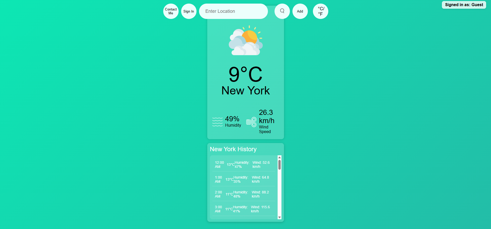
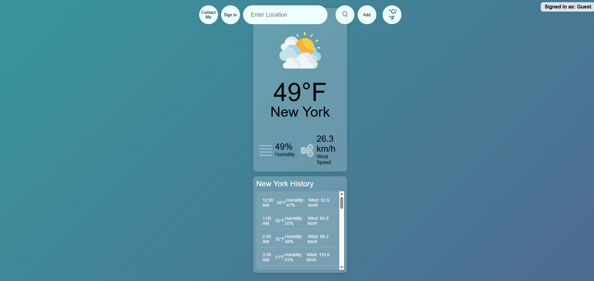
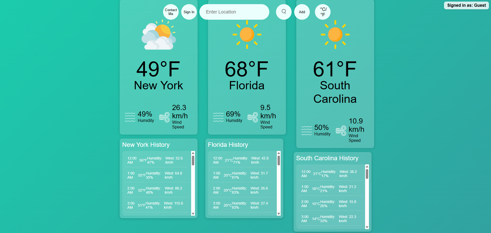
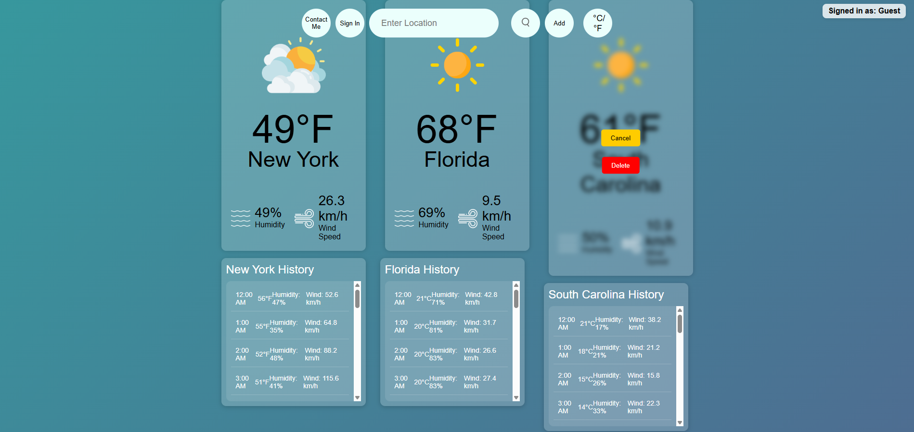
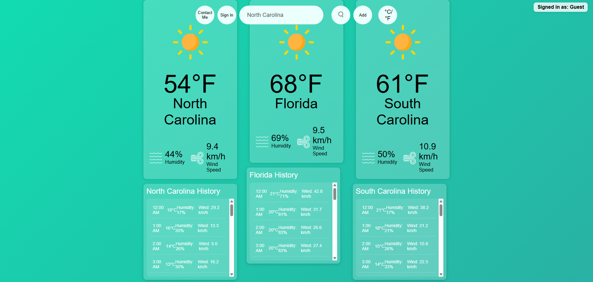
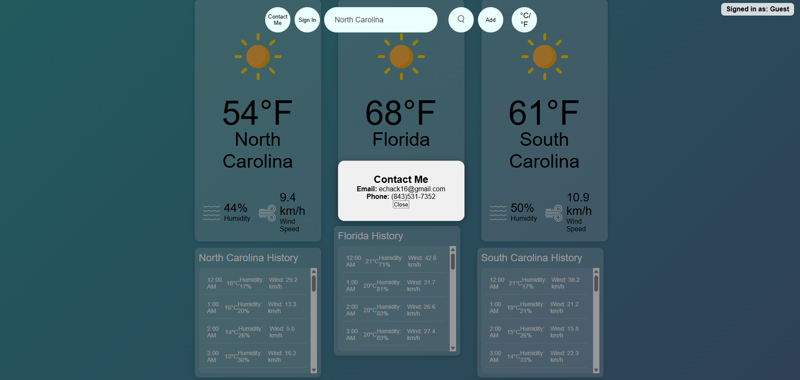
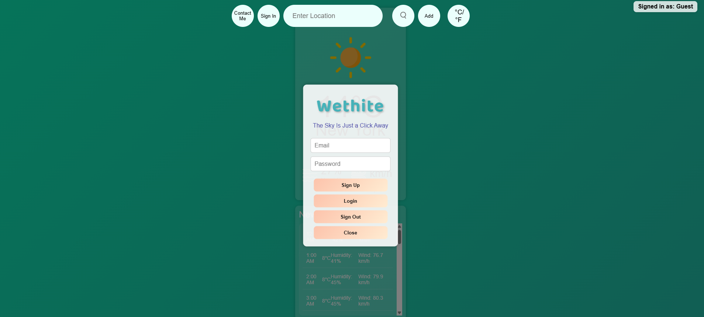
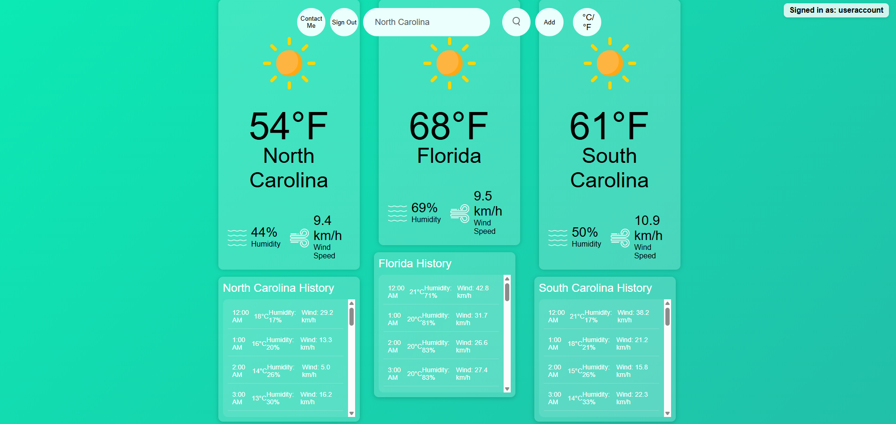

# Defense Documentation

## 1. Statement of Purpose  
### Problem Statement  
People apply weather forecasts to wear appropriate attire and stay comfortable throughout the day. The weather is, however, unpredictable, and contradictory data from various weather sources typically renders it impossible to make an estimation of what to anticipate. This can lead to discomfort or even illness from wearing inappropriate attire for the weather.

In a bid to stop this, I propose creating a website that pools information from over one weather API to provide a more realistic and accurate picture of the current and future weather. Through providing more clarity, the tool will help users make better judgment when it comes to dressing up and getting ready for the day, especially since weather patterns become more unpredictable day by day.

---

## 2. Research & Background  
I did some research on how to manipulate API's, but a lot of what I used for the project was taught at the college. I did use a template on Youtube on the kind of UI I was invisioning when thinking on how to design the project. I also used Google Firebase in order to build a secure login system for my project.

Sources Used: 
- https://www.youtube.com/watch?v=rbuSx1yEgV8            
- https://www.youtube.com/watch?v=MIYQR-Ybrn4
---

## 3. Project Language(s), Software, and Hardware  

- **Languages:**  Java, HTML, and CSS.
- **Software:**  Visual Studio Code and Firebase
- **Hardware:**  HP Envy Laptop

---

## 4. Project Requirements  
Here is a link to the project requirements.
[Link Text](https://github.com/Echack/CSU-Senior-Project/blob/master/docs/Senior%20Project%20Requirements%20Document.md)

---

## 5. Project Implementation Description & Explanation  
When designing this project I wanted it to look simplistic in way to where it would not be overwhelming to users. I used calming colors for the background to complement this design choice.
The overall design is comprised of five buttons that control the use of the project. These buttons are "Contact me", "Sign in", "Search", "Add", and "C/F". The "C/F" button was implemented so users have the choice of switching between the two measurements of temperature based on what they are the most familiar with. To complement the simplicity of the design the project only allows the use of three different locations. If users made a mistake and want to remove a location a remove feature was added so all they had to do was click it to remove the weather location. If users want to only change the display of the initial weather then all they have to do is type in a location and then click the search button. The "Contact Me" button was installed so that users would be able to contact the creator if any issues were to arise. In order for users to save their chosen locations an account system was created. Users are given the option to sign up or to sign in if an account has already been made. The overall design of this project was centered around simplicity and comfort so that any user who uses the project will feel at ease.

### Screenshots  
- **Fig 1.** Here is the layout and design. 

- **Fig 2.** When I click the C/F button it will switch between Celsius and Fahrenheit.  

- **Fig 3.** When using the search bar and clicking add you can create up to three weather displays.  

- **Fig 4.** When clicking on each weather display it will fade out the display and give a delete option.

- **Fig 5.** When searching for a location and clicking the search button it will change the location of the initial display. 

- **Fig 6.** When clicking the contact me button it will display information on how to contact the creator.  

- **Fig 7.** When clicking the sign in button a bunch of options for signing in will be displayed.  

- **Fig 8.** When signed in that persons username will be displayed at the top left.  

### Source Code  
[🔗 View the source code repository](https://github.com/Echack/CSU-Senior-Project/tree/master/Project)

---

## 6. Test Plan & Results
Here is a link to the test plan that establishes the type of testing used during the creation of the project and the results found after testing.
[Link Text](https://github.com/Echack/CSU-Senior-Project/blob/master/docs/Test%20Plan%20Document.md)

---

## 7. Challenges Overcome 
I came across a couple challenges while creating the project. The first challenge was finding API's to use and learning how to properly use their data. After an hour or two of testing I resolved the issue by following a tutorial on how to manipulate API's and their data. The second was figuring out how to setup a proper way of storying user information so I could create an account feature. I used Firebase to help me store passwords behind layers of security. Firebase stores user sign in information and saved weather data so that users will be able to have a personal connection to the site.

---

## 8. Future Enhancements  
Improvements and addition features that I would like to add in the future are...
- Music
- More fluent weather displays
- Mobile functionality
- Weather shown based on current location
- More account features like notifications
- More security features like MFA.

---

